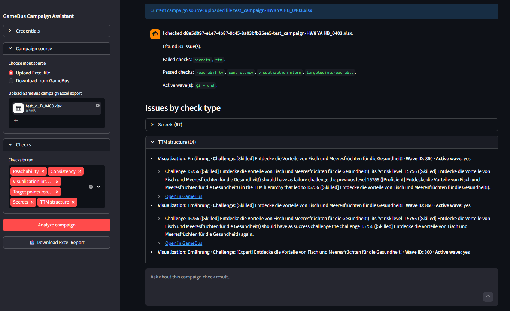

# GameBus Campaign Assistant

A local Windows-friendly assistant for checking **GameBus campaign Excel exports**.

It wraps the existing GameBus campaign checker in a more user-friendly interface and shows results in a **chat-style web app** instead of only as an Excel error report.



## What this tool does

This app helps campaign editors and researchers inspect a downloaded GameBus campaign Excel file and quickly see:

- which checks passed and failed,
- what errors were found,
- which issues are most important to fix first,
- whether there are **TTM structure** problems,
- and, optionally, download the traditional Excel error report.

## Who this is for

This tool is intended for:

- campaign editors,
- researchers,
- and other internal users working with GameBus campaign configuration files.

It is especially useful for people who want a simpler, more guided way to run the checker without working directly in Python.

## What this tool is **not** yet

This is an early version.

It currently **does not**:

- edit campaigns directly in GameBus,
- upload corrected files back into GameBus,
- generate new campaign content,
- compare two campaign files side by side,
- or fully automate campaign design.

Those features may be added later.

---

## How it works

1. Open the GameBus Campaign Assistant.
2. Enter a campaign abbreviation or upload a campaign description Excel file exported from GameBus.
3. Run the analysis.
4. Read the issues in the chat interface.
5. Optionally download the Excel error report.

---

## Main features

- Local web-based interface
- Upload one GameBus campaign Excel file
- Download campaign description from GameBus
- Run the existing campaign checker
- TTM structure checks
- Chat-style explanation of problems
- Optional Excel export of issues
- Local storage of app settings

---

## Current project status

**Status:** early public release / alpha

This version is mainly focused on:
- wrapping the existing checker,
- making results easier to understand,
- and preparing the codebase for future expansion.

---

# Installation (Windows)

## Option 1 - easiest way

If you received prepared Windows scripts with this project:

1. Download or unzip the project folder
2. Double-click `scripts/install_windows.bat`
3. Wait until installation finishes
4. Double-click `scripts/run_app.bat`

Your browser should open automatically.

---

## Option 2 - manual installation

### 1. Install Python

Install Python 3.11 or newer.

During installation, make sure to enable:

- **Add Python to PATH**

### 2. Open the project folder

Open a terminal in the project folder.

### 3. Create a virtual environment

```powershell
python -m venv .venv
````

### 4. Activate the virtual environment

```powershell
.venv\Scripts\activate
```

### 5. Install the project

```powershell
pip install -e .
```

### 6. Run the app

```powershell
streamlit run src/campaign_assistant/app.py
```

---

# How to use the app

## Step 1 - Start the app

Launch the app using the provided script or the Streamlit command above.

## Step 2 - Upload a campaign file

Upload a GameBus campaign Excel export (`.xlsx`).

## Step 3 - Run checks

Choose the checks you want to run, or run all checks.

## Step 4 - Review the results

The assistant will summarize:

* total issues found,
* failed checks,
* TTM issues,
* and which problems should be fixed first.

## Step 5 - Ask follow-up questions

Examples:

* `Summarize the issues`
* `Show TTM issues`
* `Which checks failed?`
* `What should I fix first?`

## Step 6 - Export report (optional)

You can download the Excel error report.

---

# Supported checks

Depending on the selected options, the app can run checks such as:

* consistency checks
* visualization internal checks
* reachability checks
* target-points-reachable checks
* TTM structure checks
* secret-related checks
* spelling checks

The exact behavior comes from the wrapped checker logic.

---

# Project structure

```text
src/
  campaign_assistant/
    app.py
    config.py
    storage.py
    downloader.py
    checker/
    legacy/
    ui/

docs/
tests/
logs/
scripts/
```

---

# Documentation

Additional documentation is available in the `docs/` folder.

Suggested files include:

* `docs/user-guide.md`
* `docs/installation-windows.md`
* `docs/legacy-checker.md`
* `docs/ttm-checks.md`

---
## Logging

The app writes a session log to the local `logs/` folder in JSONL format.

The log includes:
- upload or download metadata
- selected checks
- user chat messages
- assistant responses
- checker summary
- errors

Please archive the log folder at the end of the testing and send it back together with the filled feedback template `docs/pilot_feedback_template.docx`.

---

# Known limitations

* This tool works with **downloaded campaign Excel files**, not live GameBus editing.
* Not every GameBus-side issue can necessarily be inferred from the export alone.
* The TTM checks currently assume the current known TTM structure.
* This tool is currently designed primarily for **Windows** usage.

---

# Development

## Install development dependencies

```powershell
pip install -e .[dev]
```

## Run tests

```powershell
pytest
```

---

# Legacy checker

This project wraps an earlier GameBus campaign checker: https://github.com/SergeAutexier/GameBusChecker

The original checking logic is preserved and isolated in the `legacy/` part of the package, while the rest of this project provides:

* a friendlier interface,
* structured outputs,
* prioritization,
* and a base for future assistant features.

---

# License

See the `LICENSE` file.
