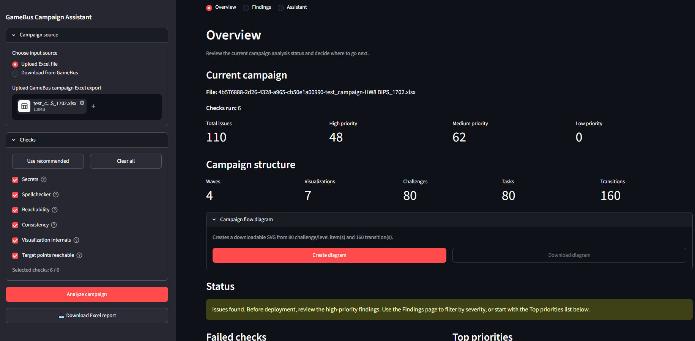

# GameBus Campaign Assistant

A local Streamlit app for inspecting **GameBus campaign Excel exports**.



## What this tool does

GameBus Campaign Assistant helps campaign organizers and researchers review a GameBus campaign configuration file.

It can help you:

* upload or download a GameBus campaign Excel export;
* run export-based campaign checks;
* see which checks passed or failed;
* inspect detected findings;
* ask one assistant chat about findings, campaign structure, possible improvements, or behavior-change theory;
* generate a simple downloadable campaign flow diagram;
* optionally use a local LLM through Ollama for richer explanations.

The app is intended to support campaign review. It does **not** replace manual checking, scientific intervention design, or empirical evaluation.

## Who this is for

This tool is intended for:

* campaign organizers;
* campaign editors;
* researchers;
* internal users working with GameBus campaign configuration files.

It is especially useful for people who want a guided interface for running and interpreting campaign checks without working directly in Python.

## Current project status

This version ([0.2.x]) focuses on:

* export-based campaign inspection;
* clearer presentation of checker results;
* assistant chat for follow-up questions;
* advisory behavior-change theory support;
* simple campaign-flow visualization.

---

# Installation

For detailed Windows installation instructions, see:

* [`docs/installation_windows.md`](docs/installation_windows.md)

## Quick start on Windows

If you received prepared Windows scripts:

1. Download or unzip the project folder.
2. Double-click `scripts/install_windows.bat`.
3. Wait until installation finishes.
4. Double-click `scripts/run_app.bat`.

The app should open in your browser.

## Alternative manual start

Open a terminal in the project folder and run:

```powershell
streamlit run src/campaign_assistant/app.py
```

The app should open at:

```text
http://localhost:8501
```

---

# How to use the app

For a user-facing step-by-step guide, see:

* [`docs/user_guide.md`](docs/user_guide.md)

Basic workflow:

1. Open the app.
2. Upload a GameBus campaign Excel export or download one from GameBus if this option is available.
3. Select the checks to run.
4. Click **Analyze campaign**.
5. Review the Overview page.
6. Inspect findings on the Findings page.
7. Ask follow-up questions in the Assistant page.
8. Optionally create and download a campaign flow diagram.

---

# Main features

## Overview page

The Overview page summarizes:

* campaign structure;
* total number of issues;
* failed and passed checks;
* top-priority findings;
* optional campaign flow diagram.

## Findings page

The Findings page shows detected issues in detail.

It helps users inspect:

* which check produced the finding;
* where the issue appears;
* why it may matter;
* what should be reviewed first.

## Assistant page

The app has one Assistant chat window.

The Assistant can answer questions about:

* checker findings;
* failed checks;
* campaign structure;
* what to inspect next;
* possible campaign improvements;
* BCTs;
* COM-B;
* TTM;
* adherence, engagement, and participant burden.

The Assistant automatically routes questions internally. Users do not need to choose an agent.

## Campaign flow diagram

The Overview page can generate a simple SVG diagram from the campaign export.

The diagram shows:

* levels/challenges;
* visualization-based tracks;
* success/standard transitions;
* failure transitions;
* task counts;
* target points when available.

The diagram can be downloaded as SVG or opened in a new browser tab.

---

# Supported checks

The current default checks are:

* `secrets`
* `reachability`
* `consistency`
* `visualizationintern`
* `targetpointsreachable`

Optional checks visible in the check picker include:

* `spellchecker` — disabled by default because it is German-only and can be slow on some machines;
* `ttm` — disabled by default because it is HW8-specific and does not prove formal TTM alignment.

The checks are implemented as native export-based validators over the GameBus campaign Excel sheets.

The checker output is the source of truth for detected export-level issues. If no issues are detected, this means only that the selected checks did not find issues. It does **not** prove that the campaign is optimal, theory-aligned, usable, or effective.

---

# LLM support

LLM support is optional.

The app can use a local Ollama model for richer assistant responses. If Ollama is unavailable or disabled, the app still works and uses deterministic fallback responses.

Example Ollama setup:

```powershell
ollama serve
ollama pull gemma3:1b
```

The configured model can be changed through environment variables, depending on your local setup.

The Assistant is advisory. It should not override deterministic checker results.

---

# Project structure

```text
src/
  campaign_assistant/
    app.py
    checker/
    legacy/
    agents/
    diagram/
    llm/
    orchestration/
    ui/

docs/
tests/
scripts/
```

Key documentation:

* [`docs/installation_windows.md`](docs/installation_windows.md)
* [`docs/user_guide.md`](docs/user_guide.md)
* [`AGENTS.md`](AGENTS.md)
* [`CHANGELOG.md`](CHANGELOG.md)

---

# Development

## Install dependencies

```powershell
pip install -r requirements.txt
```

## Install in editable mode

```powershell
pip install -e .
```

## Run the app

```powershell
streamlit run src/campaign_assistant/app.py
```

## Run tests

```powershell
pytest
```

---

# License

See the `LICENSE` file.
